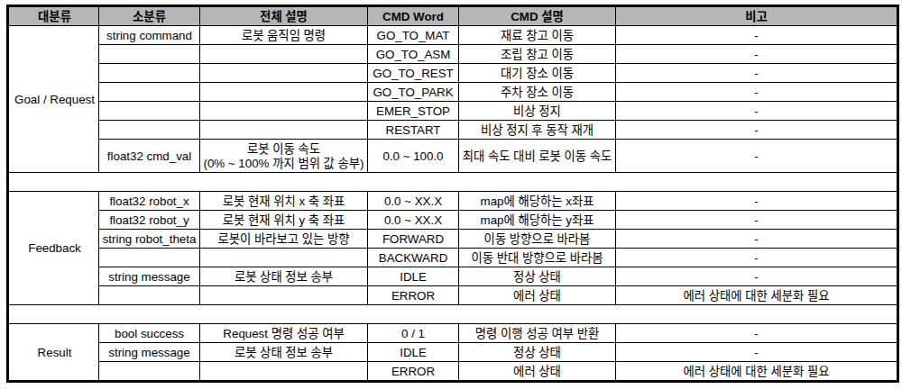

# AMR — M1 · M2 로봇 주행과 도킹

> **2026-10-09 로봇 백업 기준 정리·최적화본 — 작업 브랜치 `jh`.** 소스 반영 커밋은 `8711674`입니다.
> 두 로봇에 같은 AMR 소스를 복사하고 버거1은 `M1`, 버거2는 `M2` 프로필을 선택합니다.
> `.runtime`은 각 로봇에서 생성합니다. 다른 로봇의 빌드 결과·운행 상태를 복사하지 않습니다. 설치·경로 변경은 **[단일 폴더 사용법](docs/single_folder.md)**을 따르세요.

```bash
cd ~/AMR
python3 scripts/robot.py --robot M1 configure        # 버거2에서는 M2
python3 scripts/robot.py --robot M1 build
python3 scripts/robot.py --robot M1 camera-build
# 기존 로봇 서비스가 정지한 상태에서만 등록/전환
python3 scripts/robot.py --robot M1 install-services --replace
python3 scripts/robot.py --robot M1 doctor
```

처음 빌드에는 ROS 2 Jazzy/Nav2/TurtleBot3 의존성이 필요합니다. Pi 카메라는 `camera-build`가 AMR 내부에 설치·빌드합니다.
위 명령은 주행을 시작하지 않습니다. 이미 설치된 로봇을 호스트 공정에 연결하려면, 정지 상태에서 다음 준비 명령을 실행합니다.

```bash
python3 ~/AMR/scripts/robot.py --robot M1 host-ready  # 버거2에서는 M2
python3 ~/AMR/scripts/robot.py --robot M1 status
```

`host-ready`는 센서·위치·Nav2·모터 토크·정지 상태를 확인하고 Action 서버 시작, `RESTART`, `process` 모드 전환을 수행합니다. 목적지 이동 Goal은 보내지 않습니다. 상세 절차는 [호스트 공정 모드로 전환](#5-호스트-공정-모드로-전환)을 확인하세요.

M1(기존 Burger1), M2(기존 Burger2) **로봇 내부에서 실행하는 코드**입니다. 호스트가 목적지 명령을 보내면 로봇이 저장된 웨이포인트를 따라 이동하고, 목적지에 맞게 마커 도킹 또는 대기장소 IR 정지를 수행합니다.

별도 주행 시험용 간단한 CLI는 [tools/test_host](tools/test_host/README.md)에 있습니다. `M2 asm`, `M1 park`처럼 한 경로씩 보낼 수 있습니다.

호스트의 웹·공정 스케줄러·운영 Action Client는 별도 [host_pc 저장소](https://github.com/7s-FA/host_pc)에서 관리합니다. 이 저장소의 작업 브랜치는 `jh`이며, F1(와플)·M3의 기존 영역은 유지합니다.

- **[코드 안내 (우리 코드·원본 구분, 2026-10-09 정리·최적화 내역)](docs/code_guide_2026-10-09.md)**
- [이번 반영 내용](#이번-반영-내용)
- [로봇 구분과 동작 흐름](#로봇-구분과-동작-흐름)
- [파일 구조와 수정 위치](#파일-구조와-수정-위치)
- [명세서와 통신 규약](#명세서와-통신-규약)
- [설치와 실행 명령어](#설치와-실행-명령어)
- [검증과 관련 문서](#검증과-관련-문서)

## 이번 반영 내용

이전 `jh` 커밋 `2b5e4e7`에서 `8711674`로 **196개 파일(수정 166 · 삭제 29 · 추가 1)**을 반영했습니다.

| 구분 | 현재 코드의 변경 내용 |
|---|---|
| Action 수신 | odom·AMCL 수신을 별도 노드와 단일 스레드 실행기로 분리 |
| 대기 부하 | 웨이포인트 작업자의 센서·TF 구독과 모드 전환기의 TF 구독을 30초 미사용 시 해제. 요청 시 다시 연결 |
| 발행·조회 주기 | `idle`의 0속도 발행은 0.5초 간격, 주행 중 제어 타이머는 0.02초 유지. 반복 서비스 상태 조회는 1초 간격 |
| 카메라·도킹 | 대기 중 프레임 확인·처리 루프 빈도를 줄이고, 활성 도킹 시 프레임 확인 주기 유지 |
| 서비스 시작 오류 | `nav-control` 서비스 파일이 있으면 `systemctl start` 사용. 같은 이름의 임시 서비스를 만들어 실패하던 경로 수정 |
| 코드 정리 | 구형 카메라·지도 작성·LDS-03 스캔 변환·성능 측정·미사용 래퍼 제거. 중복 통신 보호·진단 코드는 공통 원본으로 연결 |
| 설명 | 파일 역할·호출 관계 주석과 [코드 안내서](docs/code_guide_2026-10-09.md) 추가 |

이 비교에서 수정된 YAML 14개는 설정값이 같고 주석만 추가됐습니다. Action 타입, 도킹 제어·REST·임무 접수·재시도·정지 래치의 핵심 로직도 유지했습니다. 센서 재연결과 상태 확인 주기가 달라지므로 부하 개선 수치와 실주행 결과는 별도 검증 대상입니다.

삭제된 지도 작성·진단 도구가 필요하면 Git 이력에서 확인할 수 있습니다. 현재 운용 경로·좌표는 `M1/config/`와 `M2/config/`가 기준입니다.

## 로봇 구분과 동작 흐름

2026-10-09 백업한 두 로봇의 AMR 소스 275개 파일은 동일했습니다. **공통 주행·도킹 코드는 `common/`**, 주차·카메라·경로 설정은 **`M1/`·`M2/`**에서 관리합니다. 현재 구성은 [코드 안내서](docs/code_guide_2026-10-09.md), 통신 규약은 [호스트 Action 계약](docs/host_interface.md)을 확인하세요.

| 구분 | M1 | M2 |
|---|---|---|
| 기존 이름 / 내부 ROS namespace | burger1 | burger2 |
| 외부 Action 주소 | `/M1/data` | `/M2/data` |
| ROS 도메인 | 40 | 40 |
| 주차 경로 | 웨이포인트 1 → 주차 도킹 | **웨이포인트 4 → 바로 주차 도킹** |
| 주차 마커 ID | 4, 5, 6, 7 | 8, 9, 10, 11 |
| 설정 디렉터리 | `M1/config/` | `M2/config/` |

주행·도킹 공통 코드는 `common/`에서 관리하고 지도, 초기 자세, 경로, 카메라 보정, 마커 ID 등 로봇별 값은 프로필에서 선택합니다. 내부 namespace·TF·서비스의 `burger1`/`burger2`와 ROS 패키지 이름 `waffle_navigation`은 기존 실행 코드와의 호환성을 위해 유지합니다. `TURTLEBOT3_MODEL=burger`는 하드웨어 모델 이름입니다.

```text
개별 시험: 로봇 터미널의 경로 명령 ──────────────┐
                                                ↓
호스트 연동: Burger Action → 명령 검증 → 작업 접수 → 웨이포인트 주행
                                                ↓
                              마커 도킹 / 대기장소 IR 정지
                                                ↓
                              종단 정지 검증 → 완료 결과·로그
```

| 모드 | 명령을 보내는 곳 | 용도 |
|---|---|---|
| `individual` | 해당 로봇 터미널 | M2 또는 M1을 한 대씩 시험 |
| `process` | 호스트의 ROS Action Client | 공정 순서에 따라 로봇에 목적지 요청 |

두 모드는 같은 경로·종단 동작을 사용합니다. 이동 중 모드 전환은 거부되며, `process` 모드에서는 로봇의 Action 서버도 실행되어 있어야 합니다. 공정 순서와 여러 로봇의 작업 배분은 호스트에서 결정합니다.

## 파일 구조와 수정 위치

다음은 역할을 파악하기 위한 요약입니다. 아래 전체 구조는 Git에서 관리하는 소스 목록이며 `.git`, `.runtime`, 빌드·로그·백업은 제외합니다.

```text
AMR/
├── README.md                         # 저장소 안내·명세·실행 명령
├── M1/                               # M1 설정과 개별 구현
│   ├── config/                       # 로봇 ID·Nav2·경로·도킹·카메라
│   ├── image/                        # 이미지 참고 자료용
│   ├── map/                          # 지도 PGM/YAML
│   ├── runtime_env/                  # 기존 환경 파일 이름 호환
│   ├── src/navigation/               # M1 실행 스크립트
│   ├── src/runtime/                  # M1 장치 실행·프로필별 구현
│   └── runtime_manifest.json         # 원본 → 실행 경로 및 SHA-256
├── M2/                               # M2 설정과 개별 구현
│   ├── config/
│   ├── image/
│   ├── map/
│   ├── runtime_env/
│   ├── src/navigation/
│   ├── src/runtime/
│   └── runtime_manifest.json
├── F1/                               # 와플 영역: 기존 image/src/map 유지
├── M3/                               # 기존 image/src/map 유지
├── common/
│   ├── navigation/                   # 작업 접수·모드·제어권·정지·속도 제한
│   ├── runtime/                      # 공통 도킹·카메라 구현
│   ├── docking_vision/               # 마커 검출·보드·비전 설정
│   ├── network/                      # 로봇 ROS 통신 환경
│   └── src/
│       ├── amr_mission/              # 호스트 요청을 받는 Action Server
│       └── waffle_navigation/        # Nav2 실행·웨이포인트·C++ 제어 플러그인
├── interfaces/host_pkg/               # 호스트·로봇이 공유하는 Burger.action
├── scripts/                          # 실행 디렉터리 생성·빌드·로봇 명령
├── systemd/                          # M1/M2 사용자 서비스 정의
├── patches/encoder/                  # 기존 엔코더 보호 수정·검사
├── tests/                            # 새 Action·Backend·패키징 검사
├── docs/                             # 운용·호스트 연동·문제·검증 기록
│   └── images/burger-action-spec.png # 첨부한 원본 명세서
└── dependencies.repos                # 외부 카메라 의존성 버전
```

<!-- FULL_TREE_START -->

```text
AMR/
├── F1/
│   ├── image/
│   │   └── .gitkeep
│   ├── map/
│   │   └── .gitkeep
│   └── src/
│       └── .gitkeep
├── M1/
│   ├── config/
│   │   ├── camera.yaml
│   │   ├── docking.yaml
│   │   ├── docking_board.yaml
│   │   ├── nav2.yaml
│   │   ├── parking_board.yaml
│   │   ├── robot.yaml
│   │   ├── routes.yaml
│   │   └── waypoints.yaml
│   ├── image/
│   │   └── .gitkeep
│   ├── map/
│   │   ├── .gitkeep
│   │   ├── factory_map.pgm
│   │   └── factory_map.yaml
│   ├── runtime_env/
│   │   ├── pc_burger1_env.bash
│   │   └── pc_env.bash
│   ├── src/
│   │   ├── navigation/
│   │   │   ├── ensure_docking_ready.sh
│   │   │   ├── ensure_rest_ready.sh
│   │   │   ├── ensure_waypoint_ready.sh
│   │   │   ├── launch_localization.sh
│   │   │   ├── launch_nav2.sh
│   │   │   ├── launch_owner.sh
│   │   │   ├── manage.sh
│   │   │   ├── mission_entry.sh
│   │   │   ├── mission_retry.json
│   │   │   ├── rest_ready_worker.py
│   │   │   ├── retry_ready.py
│   │   │   ├── run_rest.sh
│   │   │   ├── run_selected_waypoints.sh
│   │   │   ├── run_waypoints.sh
│   │   │   ├── save_start_pose.sh
│   │   │   ├── set_mode.sh
│   │   │   ├── start_host_ready.sh
│   │   │   ├── start_rest_ready.sh
│   │   │   ├── start_waypoint_worker.sh
│   │   │   ├── warm.sh
│   │   │   ├── waypoint_client.py
│   │   │   └── waypoint_worker.py
│   │   ├── runtime/
│   │   │   ├── base.launch.py
│   │   │   ├── camera_profile.sh
│   │   │   ├── ir_sensor.py
│   │   │   ├── setup_camera.sh
│   │   │   ├── start_base.sh
│   │   │   ├── start_camera.sh
│   │   │   ├── start_docking.sh
│   │   │   ├── start_docking_engine.sh
│   │   │   ├── start_docking_standby.sh
│   │   │   ├── test_docking_control.py
│   │   │   ├── test_docking_node.py
│   │   │   ├── test_docking_recorder.py
│   │   │   └── test_ported_alignment.py
│   │   └── .gitkeep
│   ├── README.md
│   └── runtime_manifest.json
├── M2/
│   ├── config/
│   │   ├── camera.yaml
│   │   ├── docking.yaml
│   │   ├── docking_board.yaml
│   │   ├── nav2.yaml
│   │   ├── parking_board.yaml
│   │   ├── robot.yaml
│   │   ├── routes.yaml
│   │   └── waypoints.yaml
│   ├── image/
│   │   └── .gitkeep
│   ├── map/
│   │   ├── .gitkeep
│   │   ├── factory_map.pgm
│   │   └── factory_map.yaml
│   ├── runtime_env/
│   │   ├── pc_burger2_env.bash
│   │   └── pc_env.bash
│   ├── src/
│   │   ├── navigation/
│   │   │   ├── ensure_docking_ready.sh
│   │   │   ├── ensure_rest_ready.sh
│   │   │   ├── ensure_waypoint_ready.sh
│   │   │   ├── launch_localization.sh
│   │   │   ├── launch_nav2.sh
│   │   │   ├── launch_owner.sh
│   │   │   ├── manage.sh
│   │   │   ├── mission_entry.sh
│   │   │   ├── mission_retry.json
│   │   │   ├── rest_ready_worker.py
│   │   │   ├── retry_ready.py
│   │   │   ├── run_rest.sh
│   │   │   ├── run_selected_waypoints.sh
│   │   │   ├── run_waypoints.sh
│   │   │   ├── save_start_pose.sh
│   │   │   ├── set_mode.sh
│   │   │   ├── start_host_ready.sh
│   │   │   ├── start_rest_ready.sh
│   │   │   ├── start_waypoint_worker.sh
│   │   │   ├── warm.sh
│   │   │   ├── waypoint_client.py
│   │   │   └── waypoint_worker.py
│   │   ├── runtime/
│   │   │   ├── base.launch.py
│   │   │   ├── camera_profile.sh
│   │   │   ├── ir_sensor.py
│   │   │   ├── setup_camera.sh
│   │   │   ├── start_base.sh
│   │   │   ├── start_camera.sh
│   │   │   ├── start_docking.sh
│   │   │   ├── start_docking_engine.sh
│   │   │   ├── start_docking_standby.sh
│   │   │   ├── test_docking_control.py
│   │   │   └── test_docking_node.py
│   │   └── .gitkeep
│   ├── README.md
│   └── runtime_manifest.json
├── M3/
│   ├── image/
│   │   └── .gitkeep
│   ├── map/
│   │   └── .gitkeep
│   ├── src/
│   │   └── .gitkeep
│   └── README.md
├── common/
│   ├── docking_vision/
│   │   ├── __init__.py
│   │   ├── board.py
│   │   ├── cli.py
│   │   ├── docking_config.py
│   │   ├── generate_station_boards.py
│   │   ├── source.py
│   │   └── vision.py
│   ├── navigation/
│   │   ├── action_gate.py
│   │   ├── capture_nav2_failure.py
│   │   ├── check_ready.py
│   │   ├── communication_guard.py
│   │   ├── confirm_parked.sh
│   │   ├── data_flow.py
│   │   ├── ensure_camera.sh
│   │   ├── host_prepare.py
│   │   ├── localization_only.launch.py
│   │   ├── localization_ready.py
│   │   ├── mission.sh
│   │   ├── mission_guard.sh
│   │   ├── mission_retry.py
│   │   ├── motion_client.py
│   │   ├── motion_mode.py
│   │   ├── motion_owner.py
│   │   ├── nav_control_service.sh
│   │   ├── nav_env.bash
│   │   ├── operation.py
│   │   ├── ready_monitor.py
│   │   ├── ready_parallel.py
│   │   ├── ready_watch.sh
│   │   ├── rest.sh
│   │   ├── rest_forward.py
│   │   ├── sequence_runner.py
│   │   ├── startup_state.py
│   │   ├── station_routes.py
│   │   ├── terminal_evidence.py
│   │   ├── terminal_wrapper.sh
│   │   └── watch_ready.sh
│   ├── network/
│   │   ├── nav2_local_transport.py
│   │   └── nav2_network.bash
│   ├── runtime/
│   │   ├── camera_ipc.py
│   │   ├── docking_control.py
│   │   ├── docking_network.py
│   │   ├── docking_node.py
│   │   ├── docking_recorder.py
│   │   ├── docking_standby.py
│   │   ├── docking_vision_worker.py
│   │   ├── docking_warm_client.py
│   │   ├── native_camera.cpp
│   │   ├── test_docking_recovery.py
│   │   └── video_http.py
│   ├── runtime_env/
│   │   ├── ros_setup_cache.py
│   │   └── ros_setup_fast.bash
│   └── src/
│       ├── amr_mission/
│       │   ├── amr_mission/
│       │   │   ├── __init__.py
│       │   │   ├── action_server.py
│       │   │   └── backend.py
│       │   ├── resource/
│       │   │   └── amr_mission
│       │   ├── package.xml
│       │   ├── setup.cfg
│       │   └── setup.py
│       └── waffle_navigation/
│           ├── behavior_trees/
│           │   ├── navigate_forward.xml
│           │   ├── navigate_precision_forward.xml
│           │   └── navigate_reverse.xml
│           ├── config/
│           │   ├── arrival_tuning.py
│           │   └── nav2_burger_params.yaml
│           ├── include/
│           │   └── waffle_navigation/
│           │       ├── position_approach.hpp
│           │       ├── precision_pose.hpp
│           │       └── precision_spin_speed.hpp
│           ├── launch/
│           │   ├── burger1_navigation.launch.py
│           │   ├── burger2_navigation.launch.py
│           │   ├── lean_bringup_launch.py
│           │   └── lean_navigation_launch.py
│           ├── rviz/
│           │   ├── burger1_navigation.rviz
│           │   └── burger2_navigation.rviz
│           ├── scripts/
│           │   ├── nav2_waypoints.py
│           │   └── save_start_pose.py
│           ├── src/
│           │   ├── position_approach_critic.cpp
│           │   ├── precision_pose_critic.cpp
│           │   └── precision_spin.cpp
│           ├── test/
│           │   ├── position_approach_selftest.cpp
│           │   ├── precision_pose_selftest.cpp
│           │   ├── precision_spin_loadtest.cpp
│           │   ├── precision_spin_selftest.cpp
│           │   ├── test_arrival_recovery.py
│           │   ├── test_burger2_port.py
│           │   ├── test_burger2_velocity_samples.py
│           │   ├── test_departure_retry_flag.py
│           │   ├── test_directional_waypoints.py
│           │   ├── test_encoder_departure.py
│           │   ├── test_large_heading_alignment.py
│           │   ├── test_overshoot_guard.py
│           │   ├── test_planned_path_guard.py
│           │   ├── test_position_then_yaw.py
│           │   ├── test_precision_pose_route.py
│           │   ├── test_precision_tuning.py
│           │   ├── test_staged_final.py
│           │   ├── test_start_pose.py
│           │   ├── test_terminal_approach.py
│           │   ├── test_way12_continuous.py
│           │   ├── test_way4_arrival_retry.py
│           │   └── velocity_samples.cpp
│           ├── CMakeLists.txt
│           ├── package.xml
│           ├── precision_behaviors.xml
│           └── precision_plugins.xml
├── docs/
│   ├── images/
│   │   └── burger-action-spec.png
│   ├── reference_host/
│   │   ├── 2026-10-01.md
│   │   └── source_manifest.json
│   ├── test_reports/
│   │   └── 2026-09-30.md
│   ├── code_guide_2026-10-09.md
│   ├── commands.md
│   ├── host_interface.md
│   ├── host_startup_2026-10-02.md
│   ├── known_issues.md
│   ├── namespace_terminal_update_2026-10-01.md
│   ├── single_folder.md
│   ├── troubleshooting.md
│   └── validation.md
├── interfaces/
│   ├── host_pkg/
│   │   ├── action/
│   │   │   └── Burger.action
│   │   ├── CMakeLists.txt
│   │   └── package.xml
│   └── README.md
├── patches/
│   └── encoder/
│       ├── turtlebot3_node/
│       │   ├── include/
│       │   │   └── turtlebot3_node/
│       │   │       └── sensors/
│       │   │           └── joint_state.hpp
│       │   └── src/
│       │       └── sensors/
│       │           └── joint_state.cpp
│       ├── README.md
│       ├── encoder_recovery_test.cpp
│       └── joint_state.patch
├── scripts/
│   ├── build.sh
│   ├── build_camera.sh
│   ├── doctor.py
│   ├── materialize.py
│   ├── repair_install_links.py
│   ├── robot.py
│   └── update_manifest.py
├── systemd/
│   ├── M1/
│   │   ├── burger1-host-ready.service
│   │   ├── burger1-localization.service
│   │   ├── burger1-motion-owner.service
│   │   ├── burger1-nav2.service
│   │   └── burger1-waypoint-ready.service
│   └── M2/
│       ├── burger2-host-ready.service
│       ├── burger2-localization.service
│       ├── burger2-motion-owner.service
│       ├── burger2-nav2.service
│       └── burger2-waypoint-ready.service
├── tests/
│   ├── test_action_contract.py
│   ├── test_action_ros.py
│   ├── test_backend.py
│   ├── test_communication_sync.py
│   ├── test_docking_encoder_start.py
│   ├── test_encoder_retry.py
│   ├── test_packaging.py
│   ├── test_reference_host_ros.py
│   ├── test_rest_and_routes.py
│   ├── test_rest_config_reload.py
│   ├── test_single_folder.py
│   ├── test_synced_docking.py
│   ├── test_terminal_resume.py
│   └── test_timed_departure_args.py
├── tools/
│   └── test_host/
│       ├── README.md
│       ├── build.sh
│       ├── client.py
│       ├── env.bash
│       └── run.sh
├── .gitattributes
├── .gitignore
├── README.md
└── dependencies.repos
```

<!-- FULL_TREE_END -->

| 변경하려는 내용 | 확인할 파일 |
|---|---|
| 로봇 ID·Action 주소·최대속도 | `M1/config/robot.yaml`, `M2/config/robot.yaml` |
| 목적지별 웨이포인트 순서·종단 동작 | `M1/config/routes.yaml`, `M2/config/routes.yaml` |
| 웨이포인트 좌표·방향 | 각 로봇의 `config/waypoints.yaml` |
| Nav2 주행 파라미터 | 각 로봇의 `config/nav2.yaml` |
| 도킹 제어값·카메라 보정·마커 | 각 로봇의 `config/docking.yaml`, `camera.yaml`, `docking_board.yaml`, `parking_board.yaml` |
| 호스트 명령·결과·Feedback 타입 | `interfaces/host_pkg/action/Burger.action` |
| Action 처리·기존 작업 실행 연결 | `common/src/amr_mission/amr_mission/action_server.py`, `backend.py` |
| 공통 작업 접수·제어권·속도/정지 제한 | `common/navigation/operation.py`, `motion_owner.py`, `action_gate.py` |

프로필 원본의 실행 스크립트를 직접 실행하지 않습니다. 기존 `scripts/robot.py`의 `--robot M1` 또는 `--robot M2`로 선택하며, `configure`는 `scripts/materialize.py`를 통해 `.runtime`에 소스를 연결합니다. 기존 `--runtime 경로` 명령도 유지합니다. 파일 추가 시 manifest를 갱신하고 재구성하며, ROS 패키지 변경은 재빌드합니다.

실행 결과에 생성되는 `final_robot_ws/host_ws`와 `handoff`는 기존 경로 호환용입니다. 여기에는 **로봇에서 사용하는 ROS 패키지와 환경 설정**이 들어갑니다. 호스트 PC용 웹·공정 코드·RViz 실행 도구는 이 저장소에 포함하지 않습니다.

## 명세서와 통신 규약

아래는 제공받은 원본 명세서입니다. 실제 타입 정의는 [Burger.action](interfaces/host_pkg/action/Burger.action), 세부 동작은 [호스트 Action 계약](docs/host_interface.md)에서 확인합니다.



> **RESTART 해석:** 원본 이미지에는 “비상 정지 후 동작 재개”로 표시되어 있지만, 프로젝트에서 합의한 구현은 **정지 해제만 수행**합니다. 이전 경로를 자동 재개하지 않으며, 해제 후 새 목적지 명령을 보내야 합니다.

| 구분 | 필드 | 의미 |
|---|---|---|
| Goal | `string command` | 아래 6개 명령 중 하나 |
| Goal | `float32 cmd_val` | 설정 최대속도 대비 0~100%. **m/s가 아님** |
| Feedback | `float32 robot_x`, `float32 robot_y` | 최신 AMCL map 좌표(m) |
| Feedback | `string robot_theta` | `FORWARD` / `BACKWARD`. 수치 yaw가 아님 |
| Feedback | `string message` | 정상 진행 시 `IDLE`. 도착 완료를 의미하지 않음 |
| Result | `bool success`, `string message` | 성공: `true`, `IDLE` / 실패: `false`, `ERROR` |

| Action 명령 | 개별 시험 경로 | 목적지·동작 |
|---|---|---|
| `GO_TO_MAT` | `mat` | 재료 창고 → 일반 마커 도킹 |
| `GO_TO_ASM` | `asm` | 조립대 → 일반 마커 도킹 |
| `GO_TO_REST` | `rest` | 대기장소 → IR 정지 |
| `GO_TO_PARK` | `park` | 로봇별 주차장 → 주차 마커 도킹 |
| `EMER_STOP` | — | 현재 작업 중단·정지 래치 설정 |
| `RESTART` | — | 정지 확인 후 래치 해제. 경로 재개 없음 |

이동 요청은 `0 < cmd_val <= 100`이어야 합니다. 예를 들어 최대 선속도 0.066m/s에서 50%는 출력 상한 0.033m/s입니다. 낮은 비율은 모터의 실제 최소 구동 속도와 시간 제한 때문에 주행이 실패할 수 있습니다. 제어 명령에는 0을 사용할 수 있습니다.

Action 요청 접수와 목적지 도착은 다릅니다. 호스트는 **최종 Result 성공**을 받은 뒤 다음 공정으로 넘어가야 합니다. 실패·취소 후 정지 래치가 남으면 원인과 실제 정지를 확인한 뒤 `RESTART`로 해제합니다. 재시도 소진이 복구 가능한 주행 실패로 기록된 경우에는 서버가 정지를 확인하고 새 명령 대기로 돌아갈 수 있지만, 기존 요청 결과는 `ERROR`이며 경로를 자동 재개하지 않습니다. 긴급정지·취소는 이 자동 해제 대상이 아닙니다. 원인과 goal ID는 진단 토픽·작업 JSON에 기록됩니다.

호스트 담당자는 동일한 `host_pkg`를 빌드하고 ROS 도메인 40의 `/M1/data`, `/M2/data`를 사용해야 합니다. [2026-10-01 호스트 분석](docs/reference_host/2026-10-01.md)은 당시 소스 기준의 이력이며, 현재 호스트 연동 성공을 보증하는 자료는 아닙니다.

## 설치와 실행 명령어

PC에서 별도 주행 시험을 하려면 [간단한 테스트 호스트 안내](tools/test_host/README.md)를 사용하세요. 로봇은 `process` 모드에서 Action 서버를 실행하고, PC는 `M1`/`M2` 함수로 한 경로씩 요청합니다.

**아래 설치·개별 시험 명령은 해당 로봇의 터미널에서 실행합니다.** 호스트 PC의 기존 `burger2` alias와는 별개입니다. M1과 M2 각각 설치하며, 한 번에 한 로봇의 경로만 시험해도 됩니다.

### 1. 저장소와 실행 대상 선택

Ubuntu 24.04 / ROS 2 Jazzy, Nav2·TurtleBot3 드라이버, `colcon`, Python YAML 등이 필요합니다. 드라이버가 `~/turtlebot3_ws`에 설치되어 있으면 해당 overlay를 사용합니다.

처음 내려받을 때만:

```bash
git clone --branch jh https://github.com/7s-FA/AMR.git "$HOME/AMR"
```

이후 해당 로봇의 터미널에서 아래 값을 선택합니다. **M1에서는 첫 줄만 `ROBOT_ID=M1`로 바꿉니다.**

```bash
ROBOT_ID=M2
AMR_RUNTIME="$HOME/AMR/.runtime/$ROBOT_ID"
AMR_ACTION="/$ROBOT_ID/data"
if [[ "$ROBOT_ID" == M1 ]]; then
  RUNTIME_ROBOT=burger1
  AMR_CAMERA=final_robot_camera_burger1
else
  RUNTIME_ROBOT=burger2
  AMR_CAMERA=final_robot_camera
fi
cd "$HOME/AMR"
amr() { python3 "$HOME/AMR/scripts/robot.py" --robot "$ROBOT_ID" "$@"; }
```

`amr`은 이 터미널에서만 쓰는 편의 함수입니다. 새 터미널을 열면 위 설정 블록을 다시 실행합니다. 이후 모든 명령은 선택한 로봇의 실행 디렉터리를 사용합니다.

### 2. 최초 구성·카메라 준비·빌드

```bash
amr configure
amr build
amr camera-build
# 기존 서비스가 다른 경로를 사용하면, 로봇 정지·서비스 종료 후 --replace를 붙입니다.
amr install-services
```

- `camera-build`는 AMR 내부에 libcamera 의존성과 현재 로봇의 `native_camera`를 빌드합니다. 첫 설치는 인터넷과 sudo 권한이 필요할 수 있습니다.
- `.runtime`의 소스는 `common/`·`M1/`·`M2/` 파일을 연결합니다. 경로 이동·재구성 절차는 [단일 폴더 사용법](docs/single_folder.md)을 참고하세요.
- 서비스 등록은 자동 시작하지 않습니다. 기존 서비스 교체는 정지 상태에서 `amr install-services --replace`로 명시하며 이전 유닛을 보관합니다.

### 3. 개별 시험 준비

```bash
amr mode individual
```

**로봇이 지정 주차 위치·방향에 실제로 놓여 있을 때만** 초기 위치를 확인합니다. 중간 지점에 있는 로봇에 이 명령을 사용하면 안 됩니다.

```bash
amr parked
```

Nav2·카메라를 준비하고 상태를 확인합니다. `ready`는 주행 명령이 아닙니다.

```bash
amr ready
amr status
```

### 4. 경로를 하나씩 실행

아래 표에서 원하는 명령 **하나만** 실행하고 `amr status`로 완료를 확인한 뒤 다음 경로를 요청합니다.

| 명령 | 동작 |
|---|---|
| `amr mat` | 재료 창고 이동·도킹 |
| `amr asm` | 조립대 이동·도킹 |
| `amr rest` | 대기장소 이동·IR 정지 |
| `amr park` | 주차 위치 이동·주차 도킹 |
| `amr status` | 모드·진행 단계·성공/실패·busy 확인 |
| `amr stop` | 현재 작업 중단 요청 |

예시:

```bash
amr asm
amr status
```

로컬 경로 명령은 접수 결과를 반환합니다. `status`의 작업 결과가 성공이고 `busy`가 false인지 확인합니다. `parked`는 초기 위치 확인, `park`는 실제 주차 이동입니다. `amr stop`은 로컬 작업 중단이고, Action `EMER_STOP`은 정지 래치와 odom 정지 확인까지 수행합니다.

### 5. 호스트 공정 모드로 전환

진행 중 작업이 끝나고 로봇이 정지한 상태에서, 1번의 대상 선택을 마친 터미널에서 실행합니다.

```bash
amr host-ready
amr status
```

`host-ready`는 현재 위치를 유지하며 준비합니다. 서비스·센서·위치·토크·정지 확인 후 Action 서버를 시작하고, `RESTART` 성공을 확인한 뒤 `process` 모드로 전환합니다. 준비 성공과 `mode: process`, `busy: false`를 확인한 다음 호스트에서 목적지를 요청합니다.

로봇이 **자기 지정 주차 위치·방향에 실제로 정지해 있을 때만** `amr host-ready --parked`를 사용할 수 있습니다. 이 옵션은 초기 위치를 적용하므로 중간 위치에서는 사용하지 않습니다.

이미 주행 준비가 완료되어 있고 Action 서버만 켜야 하는 경우:

```bash
amr mode process
systemctl --user start "${ROBOT_ID,,}-action.service"
amr mode
```

서버를 켜는 것만으로는 `individual`에서 `process`로 바뀌지 않습니다. `amr mode process`도 센서·모터 준비를 대신하지 않습니다. `amr action`은 터미널을 점유하는 별도 실행 방식이므로 서비스 방식과 동시에 사용하지 않습니다.

`amr` 함수를 설정하지 않은 새 터미널에서는 다음처럼 직접 호출할 수 있습니다. 버거2는 `M1`을 `M2`로 바꿉니다.

```bash
python3 ~/AMR/scripts/robot.py --robot M1 host-ready
python3 ~/AMR/scripts/robot.py --robot M1 status
```

개별 시험으로 돌아갈 때는 진행 중 작업을 먼저 종료하고, 서버를 실행한 터미널에서 Ctrl+C 또는 서비스 방식일 경우 `systemctl --user stop "${ROBOT_ID,,}-action.service"`로 종료한 다음 `amr mode individual`을 실행합니다. 정지 래치가 남아 있다면 서버를 종료하기 전에 원인을 점검하고 아래 `RESTART` 절차로 해제합니다.

### 6. Action 명령 직접 시험

로봇의 **다른 터미널**에서 1번의 대상 선택 블록을 다시 실행하고 ROS 환경을 불러옵니다. 호스트 PC에서는 호스트에 빌드한 동일한 `host_pkg` 환경을 사용하며, 아래 로봇 전용 경로를 그대로 사용하지 않습니다.

```bash
source /opt/ros/jazzy/setup.bash
source "$AMR_RUNTIME/final_robot_ws/host_ws/install/setup.bash"
export ROS_DOMAIN_ID=40
ros2 action list -t
```

실제 조립대 이동을 요청하는 예시:

```bash
ros2 action send_goal "$AMR_ACTION" host_pkg/action/Burger \
  '{command: GO_TO_ASM, cmd_val: 100.0}' --feedback
```

다른 목적지는 command를 `GO_TO_MAT`, `GO_TO_REST`, `GO_TO_PARK` 중 하나로 바꿉니다.

정지가 필요할 때:

```bash
ros2 action send_goal "$AMR_ACTION" host_pkg/action/Burger \
  '{command: EMER_STOP, cmd_val: 0.0}'
```

실패 원인을 점검하고 실제 정지를 확인한 뒤 해제할 때:

```bash
ros2 action send_goal "$AMR_ACTION" host_pkg/action/Burger \
  '{command: RESTART, cmd_val: 0.0}'
```

`RESTART`는 이전 작업을 재개하지 않습니다. odom이 없거나 정지 확인이 안 되면 해제가 실패합니다. 이 명령은 소프트웨어 정지 제어이며 물리적 비상정지 회로를 대체하지 않습니다.

### 7. 상태와 로그

```bash
amr status
journalctl --user -u "${ROBOT_ID,,}-action.service" \
  -u "$RUNTIME_ROBOT-mission.service" -n 100 --no-pager
journalctl --user -u "$RUNTIME_ROBOT-base.service" \
  -u "$RUNTIME_ROBOT-nav2.service" -n 100 --no-pager
ros2 topic echo "/$ROBOT_ID/mission/diagnostics"
```

| 기록 | 생성 위치 |
|---|---|
| 경로 명령별 결과 | `$AMR_RUNTIME/final_robot_ws/data/$RUNTIME_ROBOT/commands/` |
| 종단 도킹·대기 로그 | `$AMR_RUNTIME/final_robot_ws/data/$RUNTIME_ROBOT/terminal_logs/` |
| Action 상세 원인 | `/$ROBOT_ID/mission/diagnostics` 토픽과 Action 서비스 journal |

### 8. 호스트 명령이 거절될 때

호스트의 `rejected` 표시만으로 원인을 구분할 수 없으므로 로봇의 Action 서비스 로그를 먼저 확인합니다.

| 로그 사유 | 의미와 조치 |
|---|---|
| `PROCESS_MODE_REQUIRED` | 로봇이 `individual` 모드입니다. 준비가 끝난 정지 상태에서 `amr mode process` 후 `amr mode`로 확인하거나, 전체 준비 절차인 `amr host-ready`를 실행합니다. 모드 전환만으로 Action 서버 재시작은 필요하지 않습니다. |
| `ESTOP_LATCHED` | 정지 래치가 남아 있습니다. 원인을 점검하고 최신 odom으로 정지가 확인되는 상태에서 Action `RESTART`를 요청합니다. |
| `ROBOT_BUSY` | 임무·도킹·REST 또는 준비 작업이 진행 중입니다. `amr status`와 로그를 확인하고 작업이 끝난 뒤 요청합니다. |
| `UNKNOWN_COMMAND` / `SPEED_OUT_OF_RANGE` / `ZERO_SPEED_CANNOT_COMPLETE_ROUTE` | 명령 문자열과 `cmd_val`을 확인합니다. 이동 명령은 `0 < cmd_val <= 100`입니다. |

이미 접수한 Action이 끝나기 전 중복 요청도 거절될 수 있습니다. 서버에는 이동 요청 대기열이 없습니다.

## 검증과 관련 문서

2026-10-09 백업·업로드·소스 비교에서 확인한 범위입니다.

- 로봇 백업의 일반 파일 11,013개를 원격 원본과 SHA256으로 비교했습니다. 이 수에는 AMR 외 기존 로봇 작업공간도 포함됩니다.
- 두 로봇의 AMR 소스 275개 파일이 일치하며, `jh`의 `8711674`는 해당 정리본을 반영합니다.
- M1·M2 배포 manifest의 원본 파일 누락과 SHA256 불일치가 없습니다.
- 이전 `jh`와 YAML 설정값·Action 인터페이스·주요 제어 코드 차이를 확인했습니다.

이 확인은 **파일 무결성과 코드 비교**입니다. 이번 README 갱신에서 빌드·자동 테스트·CPU 부하 측정·실제 주행·도킹을 다시 수행하지 않았습니다. [코드 안내서](docs/code_guide_2026-10-09.md)의 최적화 당시 측정·시험 기록 및 아래 과거 문서는 각각 해당 시점의 이력으로 읽어야 합니다. 서비스가 `active`인 것만으로 모터·센서·주행 준비 완료를 판단하지 않습니다.

| 문서 | 내용 |
|---|---|
| [단일 폴더 사용법](docs/single_folder.md) | M1/M2 선택, 설치·경로 변경, `host-ready` 준비 |
| [2026-10-09 코드 안내](docs/code_guide_2026-10-09.md) | 실행 흐름·파일 역할·삭제·최적화 내역과 당시 검증 기록 |
| [실행 명령 모음](docs/commands.md) | 설치부터 개별 시험·Action 연동·로그까지 |
| [호스트 Action 계약](docs/host_interface.md) | 필드, 정지·속도 정책, 호스트 담당자 변경 사항 |
| [최초 이관 검증](docs/validation.md) | 빌드·자동 검사 결과와 검증 범위 |
| [이관 당시 문제 기록](docs/known_issues.md) | 과거 관측 이슈. 현재 재현 여부는 별도 확인 |
| [트러블슈팅](docs/troubleshooting.md) | 증상별 확인 위치 |
| [2026-09-30 시험 기록](docs/test_reports/2026-09-30.md) | 이전 실제 주행·도킹 시험 요약 |
| [엔코더 패치](patches/encoder/README.md) | 기존 보호 수정의 적용 범위 |

개발 시 기본 검사입니다. 아래의 `232`는 **실제 로봇과 분리한 자동 테스트 전용 도메인**이며 특별한 로봇 번호를 의미하지 않습니다.

| 실행 환경 | ROS_DOMAIN_ID | 통신 범위 |
|---|---|---|
| 실제 M1·M2와 호스트 운영 | **40** | 로봇·호스트가 연결된 네트워크 |
| `test_action_ros.py` 자동 검사 | **232** | 같은 PC 내부(`LOCALHOST`), 모의 실행기 사용 |

`test_action_ros.py`는 도메인 232에서만 실행되도록 검사합니다. 실제 로봇 설정을 232로 바꾸지 않습니다. 아래 `ROS_DOMAIN_ID=232 ... python3 ...` 형식은 해당 테스트 명령에만 적용되며 터미널의 운영 도메인 설정을 변경하지 않습니다.


```bash
# 원본 코드를 수정한 경우에만 manifest 해시 갱신 (README만 수정했다면 불필요)
python3 scripts/update_manifest.py
python3 -m pytest -q tests/test_rest_and_routes.py tests/test_backend.py tests/test_packaging.py
# host_pkg와 amr_mission 빌드 환경을 source한 테스트 PC에서 실행
ROS_DOMAIN_ID=232 ROS_AUTOMATIC_DISCOVERY_RANGE=LOCALHOST \
  python3 -m pytest -q tests/test_action_ros.py
```

지도·카메라 보정·마커 설정은 버전 관리합니다. 빌드 결과, 실행 로그, 원본 영상, 임시 출력, 과거 백업, 외부 카메라 소스 전체는 올리지 않습니다.
